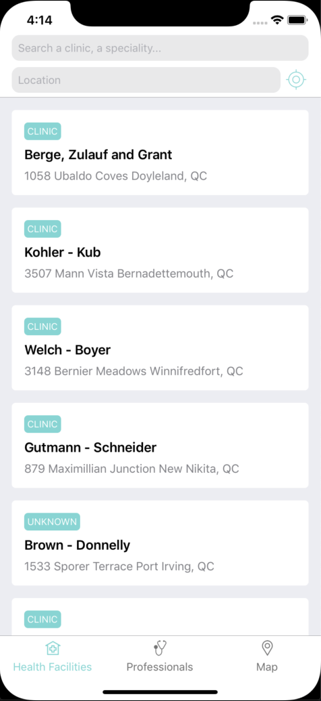
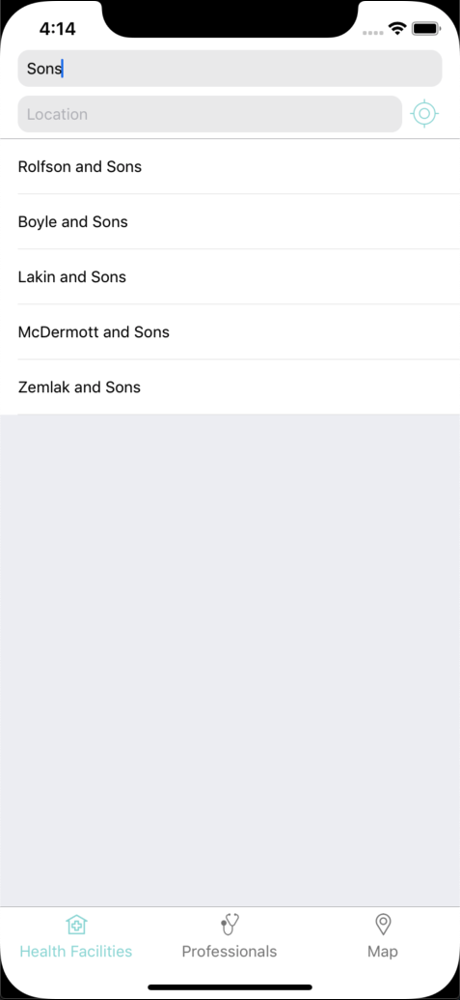
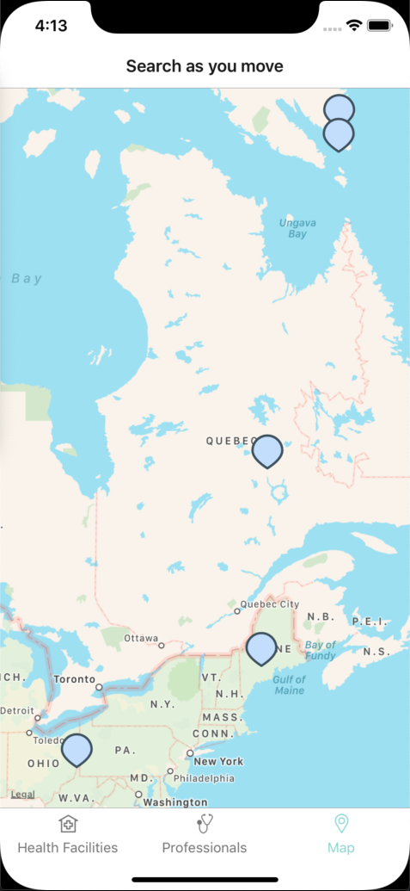

<div align="center">
  
  <h1>React-native example</h1>
  <h4>Example showcasing how the React Vision library can be used to power a react-native application</h4>
  <p>
    <a href="#features">Features</a> •
    <a href="#getting-started">Getting Started</a> •
    <a href="#credits">Credits</a>
  </p>
  
  
  
</div>

# Features

- A health facilities search box + search results view
- A professional search box + search results view
- A map view allowing the user to search health facilities as he moves the map.
- This project was bootstrapped with [Expo](https://github.com/expo/expo).

# Getting Started
This example was created for and is best showcased on an iOS device. Android and Web devices will also be able to run this example but be aware that the support for some of the components used is not optimal which may affect the experience negatively.

## To install dependencies :

```
yarn install
```

## To target a specific platform :
```
yarn start --ios
```
OR
```
yarn start --android
```
OR
```
yarn start --web
```

# Credits
<div> Icons made by <a href="https://www.flaticon.com/authors/freepik" title="Freepik">Freepik</a> from <a href="https://www.flaticon.com/" title="Flaticon">www.flaticon.com</a> :</div> 

[health_facilities](assets/health_facilities.png) <br/>
[professionals](assets/professionals.png)
